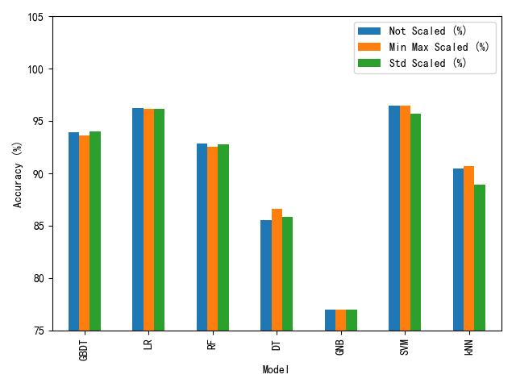

# 实战案例4-2：根据可穿戴设备识别用户行为

* 项目：根据可穿戴设备识别用户行为
* 作者：[梁斌](https://drbinliang.github.io/)
* 日期：2017/10
* 提问：[小象问答](http://wenda.chinahadoop.cn/)
* 声明：[小象学院](http://www.chinahadoop.cn/)拥有完全知识产权的权利；只限于善意学习者在本课程使用，不得在课程范围外向任何第三方散播。任何其他人或机构不得盗版、复制、仿造其中的创意，我们将保留一切通过法律手段追究违反者的权利

## 1. 项目描述：
用户行为识别数据集是通过采集30天用户的行为创建的。数据是由绑定在用户腰间的智能手机记录的，该智能手机内嵌有传感器。创建该数据集的目的是用于识别/分类6组不同的用户行为。

数据集中的用户是由19-48岁间的30个志愿者组成的。戴有智能手机（Samsung Galaxy S II）的每个志愿者会做出6个行为（WALKING, WALKING_UPSTAIRS, WALKING_DOWNSTAIRS, SITTING, STANDING, LAYING）。通过智能手机的加速计和陀螺仪能够以50Hz的频率采集3个方向的加速度和3个方向的角速度。采集后的数据集随机分为两部分，70%用于模型的训练，30%用于模型的验证。

传感器信号已经预处理去除了噪声，并且在固定时间窗口（2.56s）内进行采样，每两个窗口间有50%的重叠部分（每个窗口有128个数据）。每个时间窗口同时提供时间和频率上的统计数据作为特征。

## 2. 数据集描述:
* Kaggle[提供的数据集](https://www.kaggle.com/uciml/human-activity-recognition-with-smartphones)。数据集包含训练集（**train.csv**）和测试集（**test.csv**），形式均为CSV文件。

每条记录提供有以下数据

* 3个方向的加速度，估计的身体加速度，3个方向的角速度。最终是561维的向量。
* 对应的标签
* 志愿者编号

## 3. 项目任务：
* 3.1 数据查看
* 3.2 特征处理
* 3.3 数据建模及参数调整

## 4. 项目实现：


```python
# 引入必要的包
import csv
import os
import numpy as np
import pandas as pd
import matplotlib.pyplot as plt
import seaborn as sns
import time

%matplotlib notebook
```


```python
# 解决matplotlib显示中文问题
# 仅适用于Windows
plt.rcParams['font.sans-serif'] = ['SimHei']  # 指定默认字体
plt.rcParams['axes.unicode_minus'] = False  # 解决保存图像是负号'-'显示为方块的问题

# MacOS请参考 http://wenda.chinahadoop.cn/question/5304 修改字体配置
```


```python
# 指定数据集路径
# 说明：该数据集和第四讲的数据集相同，学员请拷贝到data目录下
dataset_path = '../data'
train_datafile = os.path.join(dataset_path, 'train.csv')
test_datafile = os.path.join(dataset_path, 'test.csv')

# 加载数据
train_data = pd.read_csv(train_datafile)
test_data = pd.read_csv(test_datafile)
```

## 4.1 数据查看


```python
print('训练集有{}条记录。'.format(len(train_data)))
print('测试集有{}条记录。'.format(len(test_data)))
```


```python
# 可视化各类别的数量统计图
plt.figure(figsize=(10, 5))

# 训练集
ax1 = plt.subplot(1, 2, 1)
sns.countplot(x='Activity', data=train_data)

plt.title('训练集')
plt.xticks(rotation='vertical')
plt.xlabel('行为类别')
plt.ylabel('数量')

# 测试集
plt.subplot(1, 2, 2, sharey=ax1)
sns.countplot(x='Activity', data=test_data)

plt.title('测试集')
plt.xticks(rotation='vertical')
plt.xlabel('行为类别')
plt.ylabel('数量')

plt.tight_layout()
```


```python
# 构建训练测试数据
# 特征处理
feat_names = train_data.columns[:-2].tolist()
X_train = train_data[feat_names].values
print('共有{}维特征。'.format(X_train.shape[1]))
X_test = test_data[feat_names].values

# 标签处理
train_labels = train_data['Activity'].values
test_labels = test_data['Activity'].values

# 使用sklearn.preprocessing.LabelEncoder进行类别标签处理
from sklearn.preprocessing import LabelEncoder

label_enc = LabelEncoder()
y_train = label_enc.fit_transform(train_labels)
y_test = label_enc.transform(test_labels)

print('类别标签：', label_enc.classes_)
for i in range(len(label_enc.classes_)):
    print('编码 {} 对应标签 {}。'.format(i, label_enc.inverse_transform(i)))
```

## 4.2 特征处理


```python
from sklearn.preprocessing import MinMaxScaler, StandardScaler

# 使用两种不同的scaler对特征进行处理

# 1. min max scaler
min_max_scaler = MinMaxScaler()
X_train_min_max_scaled = min_max_scaler.fit_transform(X_train)
X_test_min_max_scaled = min_max_scaler.transform(X_test)

# 2. standard scaler
std_scaler = StandardScaler()
X_train_std_scaled = std_scaler.fit_transform(X_train)
X_test_std_scaled = std_scaler.transform(X_test)
```

## 4.3 数据建模及参数调整


```python
from sklearn.neighbors import KNeighborsClassifier
from sklearn.linear_model import LogisticRegression
from sklearn.svm import SVC
from sklearn.tree import DecisionTreeClassifier

from sklearn.naive_bayes import GaussianNB
from sklearn.ensemble import RandomForestClassifier
from sklearn.ensemble import GradientBoostingClassifier

from sklearn.model_selection import GridSearchCV
```


```python
# 如果为了节省训练时间，可以将cv设较小的值，如 3
# 如果为了能找到模型的最优参数，可以选择较大的cv值，如 10
cv=3
```

### 4.2.1 kNN


```python
parameters = {'n_neighbors':[10, 50, 100]}
clf = GridSearchCV(KNeighborsClassifier(), parameters, cv=cv_val, scoring='accuracy')

# min max scaler
clf.fit(X_train_min_max_scaled, y_train)
print('Min Max 归一化特征：')
print('最优参数：', clf.best_params_)
print('验证集最高得分：', clf.best_score_)
print('测试集准确率：{:.3f}'.format(clf.score(X_test_min_max_scaled, y_test)))

# std scaler
clf.fit(X_train_std_scaled, y_train)
print('Std 归一化特征：')
print('最优参数：', clf.best_params_)
print('验证集最高得分：', clf.best_score_)
print('测试集准确率：{:.3f}'.format(clf.score(X_test_std_scaled, y_test)))
```

### 4.2.2 逻辑回归


```python
parameters = {'C':[0.1, 1, 10]}
clf = GridSearchCV(LogisticRegression(), parameters, cv=cv_val, scoring='accuracy')

# min max scaler
clf.fit(X_train_min_max_scaled, y_train)
print('Min Max 归一化特征：')
print('最优参数：', clf.best_params_)
print('验证集最高得分：', clf.best_score_)
print('测试集准确率：{:.3f}'.format(clf.score(X_test_min_max_scaled, y_test)))

# std scaler
clf.fit(X_train_std_scaled, y_train)
print('Std 归一化特征：')
print('最优参数：', clf.best_params_)
print('验证集最高得分：', clf.best_score_)
print('测试集准确率：{:.3f}'.format(clf.score(X_test_std_scaled, y_test)))
```

### 4.2.3 SVM


```python
parameters = {'C':[10, 100, 1000]}
clf = GridSearchCV(SVC(), parameters, cv=cv_val, scoring='accuracy')

# min max scaler
clf.fit(X_train_min_max_scaled, y_train)
print('Min Max 归一化特征：')
print('最优参数：', clf.best_params_)
print('验证集最高得分：', clf.best_score_)
print('测试集准确率：{:.3f}'.format(clf.score(X_test_min_max_scaled, y_test)))

# std scaler
clf.fit(X_train_std_scaled, y_train)
print('Std 归一化特征：')
print('最优参数：', clf.best_params_)
print('验证集最高得分：', clf.best_score_)
print('测试集准确率：{:.3f}'.format(clf.score(X_test_std_scaled, y_test)))
```

### 4.2.4 决策树


```python
parameters = {'max_depth':[50, 100, 150]}
clf = GridSearchCV(DecisionTreeClassifier(), parameters, cv=cv_val, scoring='accuracy')

clf.fit(X_train, y_train)
print('无需归一化特征：')
print('最优参数：', clf.best_params_)
print('验证集最高得分：', clf.best_score_)
print('测试集准确率：{:.3f}'.format(clf.score(X_test, y_test)))
```

### 4.2.5 朴素贝叶斯


```python
# 没有超参数
clf = GaussianNB()

# min max scaler
clf.fit(X_train_min_max_scaled, y_train)
print('Min Max 归一化特征：')
print('测试集准确率：{:.3f}'.format(clf.score(X_test_min_max_scaled, y_test)))

# std scaler
clf.fit(X_train_std_scaled, y_train)
print('Std 归一化特征：')
print('测试集准确率：{:.3f}'.format(clf.score(X_test_std_scaled, y_test)))
```

### 4.2.6 随机森林


```python
parameters = {'n_estimators':[100, 150, 200]}
clf = GridSearchCV(RandomForestClassifier(), parameters, cv=cv_val, scoring='accuracy')

clf.fit(X_train, y_train)
print('无需归一化特征：')
print('最优参数：', clf.best_params_)
print('验证集最高得分：', clf.best_score_)
print('测试集准确率：{:.3f}'.format(clf.score(X_test, y_test)))
```

### 4.2.7 GBDT


```python
parameters = {'learning_rate': [0.1, 1, 10]}
clf = GridSearchCV(GradientBoostingClassifier(), parameters, cv=cv_val, scoring='accuracy')

clf.fit(X_train, y_train)
print('无需归一化特征：')
print('最优参数：', clf.best_params_)
print('验证集最高得分：', clf.best_score_)
print('测试集准确率：{:.3f}'.format(clf.score(X_test, y_test)))
```

## 5. 项目总结
* 该项目通过分析“人体行为识别”数据集，并在该数据集上进行建模操作，包括:
    * 数据可视化
    * 数据集特征、标签的处理
    * 数据集特征归一化操作
    * kNN, 逻辑回归，SVM，决策树模，朴素贝叶斯，随机森林，GBDT
    * 使用交叉验证调整超参数
* 课后学员可模仿该项目的流程与操作，在现有数据集上通过改变模型的其他参数，观察对模型的性能有何影响
* 该项目有配套的Python代码

## 6. 参考文献
* Davide Anguita, Alessandro Ghio, Luca Oneto, Xavier Parra and Jorge L. Reyes-Ortiz. A Public Domain Dataset for Human Activity Recognition Using Smartphones. 21st European Symposium on Artificial Neural Networks, Computational Intelligence and Machine Learning, ESANN 2013. Bruges, Belgium 24-26 April 2013.

* Davide Anguita, Alessandro Ghio, Luca Oneto, Xavier Parra and Jorge L. Reyes-Ortiz. Human Activity Recognition on Smartphones using a Multiclass Hardware-Friendly Support Vector Machine. International Workshop of Ambient Assisted Living (IWAAL 2012). Vitoria-Gasteiz, Spain. Dec 2012

* Davide Anguita, Alessandro Ghio, Luca Oneto, Xavier Parra, Jorge L. Reyes-Ortiz. Energy Efficient Smartphone-Based Activity Recognition using Fixed-Point Arithmetic. Journal of Universal Computer Science. Special Issue in Ambient Assisted Living: Home Care. Volume 19, Issue 9. May 2013

* Davide Anguita, Alessandro Ghio, Luca Oneto, Xavier Parra and Jorge L. Reyes-Ortiz. Human Activity Recognition on Smartphones using a Multiclass Hardware-Friendly Support Vector Machine. 4th International Workshop of Ambient Assited Living, IWAAL 2012, Vitoria-Gasteiz, Spain, December 3-5, 2012. Proceedings. Lecture Notes in Computer Science 2012, pp 216-223.

* Jorge Luis Reyes-Ortiz, Alessandro Ghio, Xavier Parra-Llanas, Davide Anguita, Joan Cabestany, Andreu Català. Human Activity and Motion Disorder Recognition: Towards Smarter Interactive Cognitive Environments. 21st European Symposium on Artificial Neural Networks, Computational Intelligence and Machine Learning, ESANN 2013. Bruges, Belgium 24-26 April 2013.


## 7. 完整py文件版本
```python
# -*- coding: utf-8 -*-

"""
    作者:     梁斌
    版本:     1.0
    日期:     2017/10
    实战案例4-2：根据可穿戴设备识别用户行为

    该案例有配套的讲解版本，在jupyter演示版中可找到

    声明：小象学院拥有完全知识产权的权利；只限于善意学习者在本课程使用，
         不得在课程范围外向任何第三方散播。任何其他人或机构不得盗版、复制、仿造其中的创意，
         我们将保留一切通过法律手段追究违反者的权利
"""

# 引入必要的包
import os
import pandas as pd
import matplotlib.pyplot as plt
from sklearn.preprocessing import LabelEncoder
from sklearn.preprocessing import MinMaxScaler, StandardScaler
from sklearn.neighbors import KNeighborsClassifier
from sklearn.linear_model import LogisticRegression
from sklearn.svm import SVC
from sklearn.tree import DecisionTreeClassifier
from sklearn.naive_bayes import GaussianNB
from sklearn.ensemble import RandomForestClassifier
from sklearn.ensemble import GradientBoostingClassifier

from sklearn.model_selection import GridSearchCV


# 解决matplotlib显示中文问题
# 仅适用于Windows
plt.rcParams['font.sans-serif'] = ['SimHei']  # 指定默认字体
plt.rcParams['axes.unicode_minus'] = False  # 解决保存图像是负号'-'显示为方块的问题

# MacOS请参考 http://wenda.chinahadoop.cn/question/5304 修改字体配置

# 指定数据集路径
# 说明：该数据集和第四讲的数据集相同，学员请拷贝到data目录下
dataset_path = '../data'
train_datafile = os.path.join(dataset_path, 'train.csv')
test_datafile = os.path.join(dataset_path, 'test.csv')

# cv
cv_val = 3


def train_model(X_train, y_train, X_test, y_test, model_config):
    """
        返回对应的最优分类器及在测试集上的准确率
    """
    model = model_config[0]
    parameters = model_config[1]

    if parameters is not None:
        # 需要调参的模型
        clf = GridSearchCV(model, parameters, cv=cv_val, scoring='accuracy')
        clf.fit(X_train, y_train)
        print('最优参数：', clf.best_params_)
        print('验证集最高得分： {:.3f}', clf.best_score_)
    else:
        # 不需要调参的模型，如朴素贝叶斯
        model.fit(X_train, y_train)
        clf = model

    test_acc = clf.score(X_test, y_test)
    print('测试集准确率：{:.3f}'.format(test_acc))
    return clf, test_acc


def main():
    """
        主函数
    """
    # 加载数据
    train_data = pd.read_csv(train_datafile)
    test_data = pd.read_csv(test_datafile)

    # 任务1. 数据查看
    print('\n===================== 任务1. 数据查看 =====================')
    print('训练集有{}条记录。'.format(len(train_data)))
    print('测试集有{}条记录。'.format(len(test_data)))

    # 构建训练测试数据
    # 特征处理
    feat_names = train_data.columns[:-2].tolist()
    X_train = train_data[feat_names].values
    print('共有{}维特征。'.format(X_train.shape[1]))
    X_test = test_data[feat_names].values

    # 标签处理
    train_labels = train_data['Activity'].values
    test_labels = test_data['Activity'].values

    # 使用sklearn.preprocessing.LabelEncoder进行类别标签处理
    label_enc = LabelEncoder()
    y_train = label_enc.fit_transform(train_labels)
    y_test = label_enc.transform(test_labels)

    print('类别标签：', label_enc.classes_)
    for i in range(len(label_enc.classes_)):
        print('编码 {} 对应标签 {}。'.format(i, label_enc.inverse_transform(i)))

    # 任务2. 特征处理
    print('\n===================== 任务2. 特征处理 =====================')
    # 使用两种不同的scaler对特征进行处理
    # 1. min max scaler
    min_max_scaler = MinMaxScaler()
    X_train_min_max_scaled = min_max_scaler.fit_transform(X_train)
    X_test_min_max_scaled = min_max_scaler.transform(X_test)

    # 2. standard scaler
    std_scaler = StandardScaler()
    X_train_std_scaled = std_scaler.fit_transform(X_train)
    X_test_std_scaled = std_scaler.transform(X_test)

    # 任务3. 数据建模及参数调整
    print('\n===================== 任务3. 数据建模及参数调整 =====================')
    model_dict = {'kNN':    (KNeighborsClassifier(),        {'n_neighbors': [5, 10, 15]}),
                  'LR':     (LogisticRegression(),          {'C': [0.01, 1, 100]}),
                  'SVM':    (SVC(),                         {'C': [100, 1000, 10000]}),
                  'DT':     (DecisionTreeClassifier(),      {'max_depth': [50, 100, 150]}),
                  'GNB':    (GaussianNB(), None),
                  'RF':     (RandomForestClassifier(),      {'n_estimators': [100, 150, 200]}),
                  'GBDT':   (GradientBoostingClassifier(),  {'learning_rate': [0.1, 1, 10]})}

    results_df = pd.DataFrame(columns=['Not Scaled (%)', 'Min Max Scaled (%)', 'Std Scaled (%)'],
                              index=list(model_dict.keys()))
    results_df.index.name = 'Model'

    for model_name, model_config in model_dict.items():
        print('训练模型：', model_name)
        print('特征没有归一化')
        _, acc1 = train_model(X_train, y_train,
                              X_test, y_test,
                              model_config)

        print('最小最大归一化')
        _, acc2 = train_model(X_train_min_max_scaled, y_train,
                              X_test_min_max_scaled, y_test,
                              model_config)

        print('标准归一化')
        _, acc3 = train_model(X_train_std_scaled, y_train,
                              X_test_std_scaled, y_test,
                              model_config)
        print()

        results_df.loc[model_name] = [acc1 * 100, acc2 * 100, acc3 * 100]

    results_df.to_csv('./pred_results.csv')

    plt.figure(figsize=(10, 4))
    results_df.plot(kind='bar')
    plt.ylim([75, 105])
    plt.ylabel('Accuracy (%)')
    plt.tight_layout()
    plt.savefig('./pred_results.png')
    plt.show()


if __name__ == '__main__':
    main()

```
