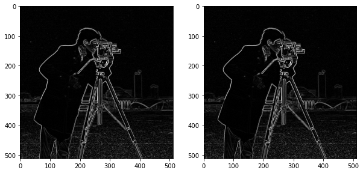

# 图像数据操作

## 1. skimage的图像数据


```python
import skimage
import matplotlib.pyplot as plt
#from __future__ import print_function
%matplotlib inline
```


```python
import numpy as np
from matplotlib import pyplot as plt

# 随机生成500x500的多维数组
random_image = np.random.random([500, 500])
#print(random_image)
plt.imshow(random_image, cmap='gray')
plt.colorbar()
```


    <matplotlib.colorbar.Colorbar at 0x831c3c8>


```python
from skimage import data

# 加载skimage中的coin数据
coins = data.coins()

print(type(coins), coins.dtype, coins.shape)
plt.imshow(coins, cmap='gray')
plt.colorbar()
```

    <class 'numpy.ndarray'> uint8 (303, 384)
    


    <matplotlib.colorbar.Colorbar at 0xaeb1f28>


```python
cat = data.chelsea()
print("图片形状:", cat.shape)
print("最小值/最大值:", cat.min(), cat.max())

plt.imshow(cat)
plt.colorbar()
```

    图片形状: (300, 451, 3)
    最小值/最大值: 0 231
    


    <matplotlib.colorbar.Colorbar at 0xaf85b70>


```python
# 在图片上叠加一个红色方块
cat[10:110, 10:110, :] = [255, 0, 0]  # [red, green, blue]
plt.imshow(cat)
```


    <matplotlib.image.AxesImage at 0x6102978>


## 2. 数据类型和像素值


```python
# 生成0-1间的2500个数据
linear0 = np.linspace(0, 1, 2500).reshape((50, 50))

# 生成0-255间的2500个数据
linear1 = np.linspace(0, 255, 2500).reshape((50, 50)).astype(np.uint8)

print("Linear0:", linear0.dtype, linear0.min(), linear0.max())
print("Linear1:", linear1.dtype, linear1.min(), linear1.max())

fig, (ax0, ax1) = plt.subplots(1, 2)
ax0.imshow(linear0, cmap='gray')
ax1.imshow(linear1, cmap='gray')
```

    Linear0: float64 0.0 1.0
    Linear1: uint8 0 255
    


    <matplotlib.image.AxesImage at 0x61b59e8>


```python
from skimage import img_as_float, img_as_ubyte

image = data.chelsea()

image_float = img_as_float(image) # 像素值范围：0-1
image_ubyte = img_as_ubyte(image) # 像素值范围：0-255

print("type, min, max:", image_float.dtype, image_float.min(), image_float.max())
print("type, min, max:", image_ubyte.dtype, image_ubyte.min(), image_ubyte.max())

print("231/255 =", 231/255.) # 验证0-255 转换到 0-1
```

    type, min, max: float64 0.0 0.905882352941
    type, min, max: uint8 0 231
    231/255 = 0.9058823529411765
    

## 3. 显示图像


```python
import matplotlib.pyplot as plt
import numpy as np
from skimage import data

image = data.camera()

plt.figure(figsize=(10, 5))

# 使用不同的color map
plt.subplot(121)
plt.imshow(image, cmap='jet')

plt.subplot(122)
plt.imshow(image, cmap='gray');
```


```python
# 通过数组切片操作获取人脸区域
face = image[80:160, 200:280]

plt.figure(figsize=(10, 5))

# 使用不同的color map
plt.subplot(121)
plt.imshow(face, cmap='jet')

plt.subplot(122)
plt.imshow(face, cmap='gray')
```


    <matplotlib.image.AxesImage at 0x10a6b128>


## 4. 图像I/O


```python
from skimage import io
image = io.imread('./images/balloon.jpg')

print(type(image))
plt.imshow(image)
```

    <class 'numpy.ndarray'>
    


    <matplotlib.image.AxesImage at 0x10b42208>


```python
# 同时加载多个图像
ic = io.imread_collection('./images/*.png')

print(type(ic), '\n\n', ic)
```

    <class 'skimage.io.collection.ImageCollection'> 
    
     ['./images\\data_analysis.png', './images\\python_logo.png', './images\\xiaoxiang_logo.png']
    


```python
f, axes = plt.subplots(nrows=1, ncols=len(ic), figsize=(15, 10))

for i, image in enumerate(ic):
    axes[i].imshow(image)
    axes[i].axis('off')
```


```python
# 保存图像
saved_img = ic[0]
io.imsave('./output/python_analysis.png', saved_img)
```

## 5. 分割和索引


```python
from skimage import data

color_image = data.chelsea()

print(color_image.shape)
plt.imshow(color_image)
```

    (300, 451, 3)
    


    <matplotlib.image.AxesImage at 0x123b9710>


```python
red_channel = color_image[:, :, 0]  # 红色通道
plt.imshow(red_channel)
print(red_channel.shape)
```

    (300, 451)
    


## 6. 色彩空间


```python
import skimage

# RGB -> Gray
gray_img = skimage.color.rgb2gray(color_image)
plt.imshow(gray_img, cmap='gray')
print(gray_img.shape)
```

    (300, 451)
    


## 7. 颜色直方图


```python
from skimage import data
from skimage import exposure

# 灰度图颜色直方图
image = data.camera()
print(image.shape)

hist, bin_centers = exposure.histogram(image)

plt.figure()
plt.fill_between(bin_centers, hist)
plt.ylim(0)
```

    (512, 512)
    


    (0, 6522.6000000000004)


```python
plt.imshow(image, cmap='gray')
```


    <matplotlib.image.AxesImage at 0x109493c8>


```python
# 彩色图像直方图
cat = data.chelsea()

# R通道
hist_r, bin_centers_r = exposure.histogram(cat[:,:,0])
# G通道
hist_g, bin_centers_g = exposure.histogram(cat[:,:,1])
# B通道
hist_b, bin_centers_b = exposure.histogram(cat[:,:,2])

plt.figure(figsize=(10, 5))

# R通道 直方图
ax = plt.subplot(131)
plt.fill_between(bin_centers_r, hist_r, facecolor='r')
plt.ylim(0)

# G通道 直方图
plt.subplot(132, sharey=ax)
plt.fill_between(bin_centers_g, hist_g, facecolor='g')
plt.ylim(0)

# B通道 直方图
plt.subplot(133, sharey=ax)
plt.fill_between(bin_centers_b, hist_b, facecolor='b')
plt.ylim(0)
```


    (0, 2122.0500000000002)


## 8. 对比度


```python
# 原图像
image = data.camera()
hist, bin_centers = exposure.histogram(image)

# 改变对比度
# image中小于10的像素值设为0，大于180的像素值设为255
high_contrast = exposure.rescale_intensity(image, in_range=(10, 180))
hist2, bin_centers2 = exposure.histogram(high_contrast)

# 图像对比 
fig, (ax_1, ax_2) = plt.subplots(ncols=2, figsize=(10, 5))
ax_1.imshow(image, cmap='gray')
ax_2.imshow(high_contrast, cmap='gray')

fig, (ax_hist1, ax_hist2) = plt.subplots(ncols=2, figsize=(10, 5), sharey=True)
ax_hist1.fill_between(bin_centers, hist)
ax_hist2.fill_between(bin_centers2, hist2)
plt.ylim(0)
```


    (0, 24830.400000000001)


### 直方图均衡化


```python
# 直方图均衡化
equalized = exposure.equalize_hist(image)
hist3, bin_centers3 = exposure.histogram(equalized)

# 图像对比 
fig, (ax_1, ax_2) = plt.subplots(ncols=2, figsize=(10, 5))
ax_1.imshow(image, cmap='gray')
ax_2.imshow(equalized, cmap='gray')

fig, (ax_hist1, ax_hist2) = plt.subplots(ncols=2, figsize=(10, 5), sharey=True)
ax_hist1.fill_between(bin_centers, hist)
ax_hist2.fill_between(bin_centers3, hist3)
plt.ylim(0)
```


    (0, 6522.6000000000004)


## 9. 图像滤波

### 9.1 中值滤波


```python
from skimage import data
from skimage.morphology import disk
from skimage.filters.rank import median

img = data.camera()
med1 = median(img, disk(3)) # 3x3中值滤波
med2 = median(img, disk(5)) # 5x5中值滤波

# 图像对比 
fig, (ax_1, ax_2, ax_3) = plt.subplots(ncols=3, figsize=(15, 10))
ax_1.imshow(img, cmap='gray')
ax_2.imshow(med1, cmap='gray')
ax_3.imshow(med2, cmap='gray')
```


    <matplotlib.image.AxesImage at 0x10bfff98>


### 9.2 高斯滤波


```python
from skimage import data
from skimage.morphology import disk
from skimage.filters import gaussian

img = data.camera()
gas1 = gaussian(img, sigma=3) # sigma=3
gas2 = gaussian(img, sigma=5) # sigma=5

# 图像对比 
fig, (ax_1, ax_2, ax_3) = plt.subplots(ncols=3, figsize=(15, 10))
ax_1.imshow(img, cmap='gray')
ax_2.imshow(gas1, cmap='gray')
ax_3.imshow(gas2, cmap='gray')
```


    <matplotlib.image.AxesImage at 0x140e3cf8>


### 9.3 均值滤波


```python
from skimage import data
from skimage.filters.rank import mean

img = data.camera()
mean1 = mean(img, disk(3)) # 3x3均值滤波
mean2 = mean(img, disk(5)) # 5x5均值滤波

# 图像对比 
fig, (ax_1, ax_2, ax_3) = plt.subplots(ncols=3, figsize=(15, 10))
ax_1.imshow(img, cmap='gray')
ax_2.imshow(mean1, cmap='gray')
ax_3.imshow(mean2, cmap='gray')
```


    <matplotlib.image.AxesImage at 0x179059b0>


## 10. 边缘检测


```python
from skimage.filters import prewitt, sobel


edge_prewitt = prewitt(image)
edge_sobel = sobel(image)

fig, (ax_1, ax_2) = plt.subplots(ncols=2, figsize=(10, 5))

# Prewitt 边缘检测
ax_1.imshow(edge_prewitt, cmap=plt.cm.gray)

# Sobel 边缘检测
ax_2.imshow(edge_sobel, cmap=plt.cm.gray)
```


    <matplotlib.image.AxesImage at 0x14880908>





```python

```
