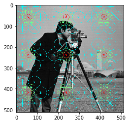
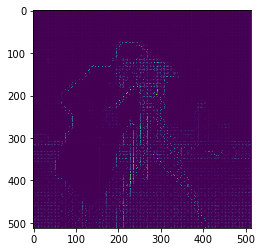

# 常用的图像特征

## 1. 颜色特征


```python
from skimage import data, img_as_float, exposure

# 如果需要使用参数nbins，需要将图像数据从[0, 255]转换到[0, 1]
camera = img_as_float(data.camera())

# 颜色直方图
hist, bin_centers = exposure.histogram(camera, nbins=10)
print(hist)
print(bin_centers)
```

    [51199  8554  6922  8834 31923 45742 82660 23862  1470   978]
    [ 0.05  0.15  0.25  0.35  0.45  0.55  0.65  0.75  0.85  0.95]
    

## SIFT 特征 (DAISY特征)


```python
from skimage.feature import daisy
import matplotlib.pyplot as plt
%matplotlib inline

daisy_feat, daisy_img = daisy(camera,step=180, radius=58, rings=2, histograms=6, visualize=True)
#daisy_feat, daisy_img = daisy(camera, visualize=True)
print(daisy_feat.shape)
plt.imshow(daisy_img)
```

    (3, 3, 104)
    


    <matplotlib.image.AxesImage at 0x6315f28>





## skimage -- HOG 特征


```python
from skimage.feature import hog
import matplotlib.pyplot as plt
%matplotlib inline

hog_feat, hog_img = hog(camera, visualise=True)
print(hog_feat.shape)
plt.imshow(hog_img)
```

    C:\Anaconda2\envs\py35\lib\site-packages\skimage\feature\_hog.py:119: skimage_deprecation: Default value of `block_norm`==`L1` is deprecated and will be changed to `L2-Hys` in v0.15
      'be changed to `L2-Hys` in v0.15', skimage_deprecation)
    

    (311364,)
    


    <matplotlib.image.AxesImage at 0x659d5f8>





```python

```
