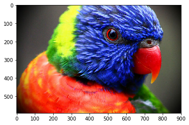
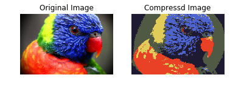

# K-Means聚类及图像压缩


```python
import numpy as np
from skimage import io
from skimage import img_as_ubyte
import matplotlib.pyplot as plt 

%matplotlib inline
```


```python
original_img = io.imread('./images/ColorfulBird.jpg')
original_img = img_as_ubyte(original_img) 
print('图像维度：', original_img.shape)

plt.imshow(original_img)
```

    图像维度： (592, 900, 3)
    


    <matplotlib.image.AxesImage at 0xa5a48d0>





```python
height, width, depth = original_img.shape

# 将图像数据点平铺
# 每个数据点为一个3维的样本
pixel_sample = np.reshape(original_img, (height * width, depth))

print('前10个像素点：')
print(pixel_sample[:10, :])
```

    前10个像素点：
    [[1 1 1]
     [1 1 1]
     [1 1 1]
     [1 1 1]
     [1 1 1]
     [2 2 2]
     [2 2 2]
     [2 2 2]
     [2 2 2]
     [2 2 2]]
    


```python
from sklearn.cluster import KMeans

# 压缩后图片包含的颜色个数，即为聚类的个数
k = 5
kmeans = KMeans(n_clusters=k, random_state=0)
# 训练模型
kmeans.fit(pixel_sample)

# 找到每个3维像素点对应的聚类中心
cluster_assignments = kmeans.predict(pixel_sample)
```


```python
# 每个样本聚类的结果是对应的聚类中心的 索引
print(set(cluster_assignments))
```

    {0, 1, 2, 3, 4}
    


```python
# 聚类中心值
cluster_centers = kmeans.cluster_centers_
print(cluster_centers.shape)
print(cluster_centers)
```

    (5, 3)
    [[  80.03400645   89.20201367   68.2303358 ]
     [ 232.90985542   65.90535659   38.10016894]
     [ 225.51306336  203.0580848    89.32899476]
     [  78.99138571  100.30588606  206.16867592]
     [  29.57005003   26.90886669   50.32638686]]
    


```python
compressed_img = np.zeros( (height, width, depth), dtype=np.uint8)

# 遍历每个像素点，找到聚类中心对应的像素值
pixel_count = 0
for i in range(height):
    for j in range(width):
        # 获取像素点的聚类中心的索引
        cluster_idx = cluster_assignments[pixel_count]
        
        # 获取聚类中心索引位置上的像素值
        cluster_value = cluster_centers[cluster_idx]
        
        # 赋值
        compressed_img[i][j] = cluster_value
        pixel_count += 1

io.imsave('./images/compressed_image.jpg',compressed_img)

plt.subplot(122)
plt.title('Compressd Image')
plt.imshow(compressed_img)
plt.axis('off')

plt.subplot(121)
plt.title('Original Image')
plt.imshow(original_img)
plt.axis('off')
plt.show()
```





```python

```
