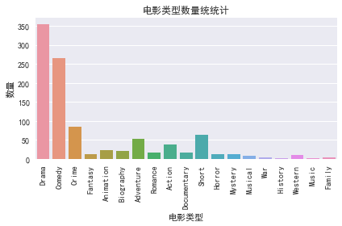
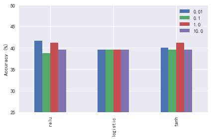

# 实战案例5-2：根据海报预测电影分类

* 项目：根据海报预测电影分类
* 作者：[梁斌](https://drbinliang.github.io/)
* 日期：2017/10
* 提问：[小象问答](http://wenda.chinahadoop.cn/)
* 声明：[小象学院](http://www.chinahadoop.cn/)拥有完全知识产权的权利；只限于善意学习者在本课程使用，不得在课程范围外向任何第三方散播。任何其他人或机构不得盗版、复制、仿造其中的创意，我们将保留一切通过法律手段追究违反者的权利

## 1. 项目描述：
电影海报是获取电影内容和类型的途径之一。用户可以通过海报的一些信息（如：颜色，演员的表情等）推测出其所属的类型（恐怖片，喜剧，动画等）。研究表明图像的颜色是影响人类感觉（心情）的因素之一，在本次项目中，我们会通过海报的颜色信息构建模型，并对其所属的电影类型进行推测。

## 2. 数据集描述:
* Kaggle[提供的数据集](https://www.kaggle.com/neha1703/movie-genre-from-its-poster/version/1)。数据采集自IMDB网站，包含电影信息（**MovieGenre.csv**）和电影的海报图片（**SampleMoviePosters**）。

**MovieGenre.csv** 数据字典：
* **imdbId**，IMDB中电影的Id
* **Imdb Link**，IMDB中电影的链接
* **Title**，电影名称
* **IMDB Score**，IMDB中电影的评分
* **Genre**，电影类型
* **Poster**，电影海报链接

**SampleMoviePosters** 目录中包含了电影的海报图片（*.jpg），图片的文件名为IMDB中对应的电影Id

## 3. 项目任务：
* 3.1 数据查看及处理
* 3.2 特征表示
* 3.3 模型验证

## 4. 项目实现：


```python
# 引入必要的包
import csv
import os
import numpy as np
import pandas as pd
import matplotlib.pyplot as plt
import seaborn as sns
import time

%matplotlib inline
```


```python
# 解决matplotlib显示中文问题
# 仅适用于Windows
plt.rcParams['font.sans-serif'] = ['SimHei']  # 指定默认字体
plt.rcParams['axes.unicode_minus'] = False  # 解决保存图像是负号'-'显示为方块的问题

# MacOS请参考 http://wenda.chinahadoop.cn/question/5304 修改字体配置
```

### 4.1 数据查看及处理


```python
# 指定数据集路径
dataset_path = '../data'
csv_filepath = os.path.join(dataset_path, 'MovieGenre.csv')
poster_path = os.path.join(dataset_path, 'SampleMoviePosters')

# 加载数据
movie_df = pd.read_csv(csv_filepath, encoding='ISO-8859-1',
                       usecols=['imdbId', 'Title', 'IMDB Score', 'Genre'])
movie_df.head()
```


<div>
<style>
    .dataframe thead tr:only-child th {
        text-align: right;
    }

    .dataframe thead th {
        text-align: left;
    }

    .dataframe tbody tr th {
        vertical-align: top;
    }
</style>
<table border="1" class="dataframe">
  <thead>
    <tr style="text-align: right;">
      <th></th>
      <th>imdbId</th>
      <th>Title</th>
      <th>IMDB Score</th>
      <th>Genre</th>
    </tr>
  </thead>
  <tbody>
    <tr>
      <th>0</th>
      <td>114709</td>
      <td>Toy Story (1995)</td>
      <td>8.3</td>
      <td>Animation|Adventure|Comedy</td>
    </tr>
    <tr>
      <th>1</th>
      <td>113497</td>
      <td>Jumanji (1995)</td>
      <td>6.9</td>
      <td>Action|Adventure|Family</td>
    </tr>
    <tr>
      <th>2</th>
      <td>113228</td>
      <td>Grumpier Old Men (1995)</td>
      <td>6.6</td>
      <td>Comedy|Romance</td>
    </tr>
    <tr>
      <th>3</th>
      <td>114885</td>
      <td>Waiting to Exhale (1995)</td>
      <td>5.7</td>
      <td>Comedy|Drama|Romance</td>
    </tr>
    <tr>
      <th>4</th>
      <td>113041</td>
      <td>Father of the Bride Part II (1995)</td>
      <td>5.9</td>
      <td>Comedy|Family|Romance</td>
    </tr>
  </tbody>
</table>
</div>


```python
# 处理genre列，使其只包含一种类型
movie_df['Single Genre'] = movie_df['Genre'].str.split('|', expand=True)[0]
print('csv有{}条记录。'.format(len(movie_df)))
movie_df.head()
```

    csv有40108条记录。
    


<div>
<style>
    .dataframe thead tr:only-child th {
        text-align: right;
    }

    .dataframe thead th {
        text-align: left;
    }

    .dataframe tbody tr th {
        vertical-align: top;
    }
</style>
<table border="1" class="dataframe">
  <thead>
    <tr style="text-align: right;">
      <th></th>
      <th>imdbId</th>
      <th>Title</th>
      <th>IMDB Score</th>
      <th>Genre</th>
      <th>Single Genre</th>
    </tr>
  </thead>
  <tbody>
    <tr>
      <th>0</th>
      <td>114709</td>
      <td>Toy Story (1995)</td>
      <td>8.3</td>
      <td>Animation|Adventure|Comedy</td>
      <td>Animation</td>
    </tr>
    <tr>
      <th>1</th>
      <td>113497</td>
      <td>Jumanji (1995)</td>
      <td>6.9</td>
      <td>Action|Adventure|Family</td>
      <td>Action</td>
    </tr>
    <tr>
      <th>2</th>
      <td>113228</td>
      <td>Grumpier Old Men (1995)</td>
      <td>6.6</td>
      <td>Comedy|Romance</td>
      <td>Comedy</td>
    </tr>
    <tr>
      <th>3</th>
      <td>114885</td>
      <td>Waiting to Exhale (1995)</td>
      <td>5.7</td>
      <td>Comedy|Drama|Romance</td>
      <td>Comedy</td>
    </tr>
    <tr>
      <th>4</th>
      <td>113041</td>
      <td>Father of the Bride Part II (1995)</td>
      <td>5.9</td>
      <td>Comedy|Family|Romance</td>
      <td>Comedy</td>
    </tr>
  </tbody>
</table>
</div>


```python
# 将海报文件路径和csv进行合并操作
# 构造海报dataframe
poster_df = pd.DataFrame(columns=['imdbId', 'img_path'])

poster_df['img_path'] = os.listdir(poster_path)
poster_df['imdbId'] = poster_df['img_path'].str[:-4].astype('int')

poster_df.head()
```


<div>
<style>
    .dataframe thead tr:only-child th {
        text-align: right;
    }

    .dataframe thead th {
        text-align: left;
    }

    .dataframe tbody tr th {
        vertical-align: top;
    }
</style>
<table border="1" class="dataframe">
  <thead>
    <tr style="text-align: right;">
      <th></th>
      <th>imdbId</th>
      <th>img_path</th>
    </tr>
  </thead>
  <tbody>
    <tr>
      <th>0</th>
      <td>10040</td>
      <td>10040.jpg</td>
    </tr>
    <tr>
      <th>1</th>
      <td>10057</td>
      <td>10057.jpg</td>
    </tr>
    <tr>
      <th>2</th>
      <td>10071</td>
      <td>10071.jpg</td>
    </tr>
    <tr>
      <th>3</th>
      <td>10155</td>
      <td>10155.jpg</td>
    </tr>
    <tr>
      <th>4</th>
      <td>10195</td>
      <td>10195.jpg</td>
    </tr>
  </tbody>
</table>
</div>


```python
data_df = movie_df.merge(poster_df, on='imdbId', how='inner')
data_df.drop_duplicates(subset=['imdbId'], inplace=True)
print('数据集有{}条记录。'.format(len(data_df)))
data_df.head()
```

    数据集有998条记录。
    


<div>
<style>
    .dataframe thead tr:only-child th {
        text-align: right;
    }

    .dataframe thead th {
        text-align: left;
    }

    .dataframe tbody tr th {
        vertical-align: top;
    }
</style>
<table border="1" class="dataframe">
  <thead>
    <tr style="text-align: right;">
      <th></th>
      <th>imdbId</th>
      <th>Title</th>
      <th>IMDB Score</th>
      <th>Genre</th>
      <th>Single Genre</th>
      <th>img_path</th>
    </tr>
  </thead>
  <tbody>
    <tr>
      <th>0</th>
      <td>24252</td>
      <td>Liebelei (1933)</td>
      <td>7.7</td>
      <td>Drama|Romance</td>
      <td>Drama</td>
      <td>24252.jpg</td>
    </tr>
    <tr>
      <th>1</th>
      <td>25316</td>
      <td>It Happened One Night (1934)</td>
      <td>8.2</td>
      <td>Comedy|Romance</td>
      <td>Comedy</td>
      <td>25316.jpg</td>
    </tr>
    <tr>
      <th>2</th>
      <td>25164</td>
      <td>The Gay Divorcee (1934)</td>
      <td>7.6</td>
      <td>Comedy|Musical|Romance</td>
      <td>Comedy</td>
      <td>25164.jpg</td>
    </tr>
    <tr>
      <th>3</th>
      <td>17350</td>
      <td>The Scarlet Letter (1926)</td>
      <td>7.8</td>
      <td>Drama</td>
      <td>Drama</td>
      <td>17350.jpg</td>
    </tr>
    <tr>
      <th>4</th>
      <td>25586</td>
      <td>Of Human Bondage (1934)</td>
      <td>7.3</td>
      <td>Drama|Romance</td>
      <td>Drama</td>
      <td>25586.jpg</td>
    </tr>
  </tbody>
</table>
</div>


```python
# 查看各电影类型的数量
data_df.groupby('Single Genre').size().sort_values(ascending=False)
```


    Single Genre
    Drama          354
    Comedy         266
    Crime           84
    Short           63
    Adventure       53
    Action          37
    Animation       23
    Biography       20
    Documentary     17
    Romance         16
    Fantasy         12
    Horror          12
    Mystery         12
    Western         11
    Musical          8
    Family           3
    War              3
    History          2
    Music            2
    dtype: int64


```python
# 可视化各类别的数量统计图
plt.figure()

# 训练集
sns.countplot(x='Single Genre', data=data_df)

plt.title('电影类型数量统统计')
plt.xticks(rotation='vertical')
plt.xlabel('电影类型')
plt.ylabel('数量')

plt.tight_layout()
```





有些电影类型过于少，不利于预测。将上述问题抓换为3分类问题：Drama, Comedy, Other


```python
cond = (data_df['Single Genre'] != 'Drama') & (data_df['Single Genre'] != 'Comedy')
data_df.loc[cond, 'Single Genre'] = 'Other'
data_df.reset_index(inplace=True)
# 查看各电影类型的数量
data_df.groupby('Single Genre').size().sort_values(ascending=False)
```


    Single Genre
    Other     378
    Drama     354
    Comedy    266
    dtype: int64


### 4.2 特征表示


```python
from skimage import io, exposure

# 提取出每个图片的直方图作为颜色特征
def extract_hist_feat(img_path, nbins=50, as_grey=True):
    """
        提取出每个图片的直方图作为颜色特征
        img_path: 图片路径
        nbins: 直方图bin的个数，即特征的维度
    """
    image_data = io.imread(img_path, as_grey=as_grey)
    
    if as_grey:
        # 灰度图片
        # 直方图均衡化
        eq_image_data = exposure.equalize_hist(image_data)
        
        # 提取直方图特征
        hist_feat, _ = exposure.histogram(eq_image_data, nbins=nbins)
        
        # 统计直方图频率（归一化特征），避免因为图片的尺寸不同导致直方图统计个数的不同，
        norm_hist_feat = hist_feat / sum(hist_feat)
    else:
        # 彩色图片
        # 每个通道提取直方图，然后做合并
        
        # 直方图均衡化
        r_eq_image_data = exposure.equalize_hist(image_data[:, :, 0])
        g_eq_image_data = exposure.equalize_hist(image_data[:, :, 1])
        b_eq_image_data = exposure.equalize_hist(image_data[:, :, 2])
        
        # R通道
        r_hist_feat, _ = exposure.histogram(r_eq_image_data, nbins=nbins)
        norm_r_hist_feat = r_hist_feat / sum(r_hist_feat)
        
        # G通道
        g_hist_feat, _ = exposure.histogram(g_eq_image_data, nbins=nbins)
        norm_g_hist_feat = g_hist_feat / sum(g_hist_feat)
        
        # B 通道
        b_hist_feat, _ = exposure.histogram(b_eq_image_data, nbins=nbins)
        norm_b_hist_feat = b_hist_feat / sum(b_hist_feat)
        
        norm_hist_feat = np.concatenate((norm_r_hist_feat, norm_g_hist_feat, norm_b_hist_feat))
    
    
    return norm_hist_feat
# 测试一张图片
img_path = os.path.join(poster_path, data_df.loc[1, 'img_path'])
hist_feat = extract_hist_feat(img_path, as_grey=False)
print(hist_feat)
```

    [ 0.03175742  0.01381827  0.01168608  0.0239462   0.02335165  0.02365918
      0.          0.02513531  0.02456126  0.01925127  0.03290553  0.01431032
      0.01513039  0.02579137  0.021732    0.01836969  0.01687305  0.0261399
      0.01590946  0.01672954  0.02318763  0.01869772  0.02384369  0.02007135
      0.01818517  0.02150648  0.01943579  0.01910776  0.01937428  0.01970231
      0.01990733  0.02080941  0.01863621  0.01988683  0.02025586  0.01902575
      0.01988683  0.01898475  0.01972281  0.01640151  0.01873872  0.02337215
      0.01664753  0.02322864  0.01687305  0.0227776   0.01966131  0.01775463
      0.02037887  0.0228801   0.03708791  0.01613498  0.02226505  0.0152534
      0.02339265  0.          0.02851812  0.02745203  0.          0.02890766
      0.02630392  0.01978432  0.01804166  0.02849762  0.02105544  0.01781614
      0.02140397  0.01990733  0.01584796  0.02273659  0.02140397  0.02027637
      0.0174266   0.02162949  0.01830818  0.02031737  0.02046088  0.01982532
      0.01906675  0.0195998   0.01855421  0.01896424  0.02134246  0.01832869
      0.02050189  0.01994834  0.01880023  0.01898475  0.01818517  0.02119895
      0.01746761  0.02154748  0.01927177  0.01898475  0.02099393  0.01841069
      0.02087092  0.01836969  0.02070691  0.01984583  0.08022388  0.00918485
      0.03274151  0.01642201  0.01605298  0.01539692  0.01609398  0.01529441
      0.03220846  0.01467935  0.01381827  0.0250328   0.0217525   0.01757012
      0.01607348  0.02007135  0.01767263  0.02162949  0.01826718  0.01691406
      0.02138347  0.0152124   0.01769313  0.02290061  0.01650402  0.01896424
      0.02009185  0.01947679  0.01728309  0.01775463  0.01695506  0.02214204
      0.01660653  0.0206044   0.01693456  0.02056339  0.01832869  0.01783664
      0.01855421  0.01808266  0.02029687  0.01867722  0.01855421  0.01730359
      0.0206044   0.01705757  0.01902575  0.01970231  0.01886174  0.01894374]
    


```python
# 对数据集中的每张图片进行特征提取
n_feat_dim = 100
n_samples = len(data_df)

# 初始化特征矩阵
X = np.zeros((n_samples, n_feat_dim))
print(X.shape)

for i, r_data in data_df.iterrows():
    if (i + 1) % 100 == 0:
        print('正在提取特征，已完成{}个海报'.format(i + 1))
    img_path = os.path.join(poster_path, r_data['img_path'])
    hist_feat = extract_hist_feat(img_path, n_feat_dim)
    # 赋值到特征矩阵中
    X[i, :] = hist_feat.copy()
```

    (998, 100)
    正在提取特征，已完成100个海报
    正在提取特征，已完成200个海报
    正在提取特征，已完成300个海报
    正在提取特征，已完成400个海报
    正在提取特征，已完成500个海报
    正在提取特征，已完成600个海报
    正在提取特征，已完成700个海报
    正在提取特征，已完成800个海报
    正在提取特征，已完成900个海报
    


```python
# 获取标签名称
target_names = data_df['Single Genre'].values

from sklearn.preprocessing import LabelEncoder
label_enc = LabelEncoder()
y = label_enc.fit_transform(target_names)
```


```python
# 分割训练集和测试集
from sklearn.model_selection import train_test_split

X_train, X_test, y_train, y_test = train_test_split(X, y, test_size=1/4, random_state=0)
print('训练集样本数：', len(X_train))
print('测试集样本数：', len(X_test))
```

    训练集样本数： 748
    测试集样本数： 250
    


```python
from sklearn.preprocessing import MinMaxScaler

# 特征归一化
scaler = MinMaxScaler()
X_train_scaled  = scaler.fit_transform(X_train)
X_test_scaled = scaler.transform(X_test)
```

至此，数据集已经处理完毕，接下来可以进行数据建模了。

### 4.3 数据建模及验证


```python
from sklearn.neural_network import MLPClassifier

activations = ['relu', 'logistic', 'tanh']
alphas = [0.01, 0.1, 1, 10]

results_df = pd.DataFrame(index=activations, columns=alphas)

for activation in activations:
    print('激活函数：{}'.format(activation))
    for alpha in alphas:
        ann_model = MLPClassifier(hidden_layer_sizes=[100, 100], activation=activation, alpha=alpha,
                                  solver='lbfgs', random_state=0)
        ann_model.fit(X_train_scaled, y_train)
        print('alpha：{}'.format(alpha))
        acc = ann_model.score(X_test_scaled, y_test)
        print('准确率：{:.3f}'.format(acc))
        
        results_df.loc[activation, alpha] = acc * 100
        
    print()
```

    激活函数：relu
    alpha：0.01
    准确率：0.416
    alpha：0.1
    准确率：0.388
    alpha：1
    准确率：0.412
    alpha：10
    准确率：0.396
    
    激活函数：logistic
    alpha：0.01
    准确率：0.396
    alpha：0.1
    准确率：0.396
    alpha：1
    准确率：0.396
    alpha：10
    准确率：0.396
    
    激活函数：tanh
    alpha：0.01
    准确率：0.400
    alpha：0.1
    准确率：0.396
    alpha：1
    准确率：0.412
    alpha：10
    准确率：0.396
    
    


```python
# 结果展示
results_df.plot(kind='bar', ylim=[25, 50])
plt.ylabel('Accuracy (%)')
plt.tight_layout()
plt.savefig('./pred_results.png')
plt.show()
```





## 5. 项目总结
* 该项目实现了一个可以根据海报预测电影分类的项目，包括:
    * 神经网络的实现
    * 特征处理
    * 课后学员可模仿该项目的流程与操作，在其他数据集上进行实验，强化理解
    * 学员可根据第六节项目代码完成模型的保存/持久化
    * 调整特征维度和神经元个数，观察对结果有何影响
* 该项目有配套的Python代码


```python

```
