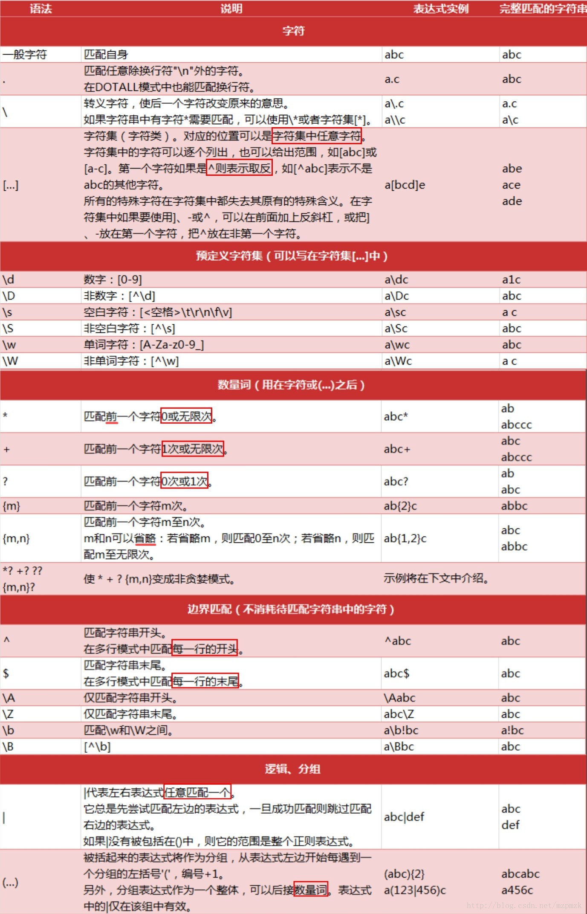

# Python文本数据处理

## 1. 文本基本操作


```python
text1 = 'Python is a widely used high-level programming language for general-purpose programming, created by Guido van Rossum and first released in 1991.'
```


```python
# 字符个数
len(text1)
```


    144


```python
# 获取单词
text2 = text1.split(' ')

print('单词个数：', len(text2))
```

    单词个数： 21
    


```python
text2
```


    ['Python',
     'is',
     'a',
     'widely',
     'used',
     'high-level',
     'programming',
     'language',
     'for',
     'general-purpose',
     'programming,',
     'created',
     'by',
     'Guido',
     'van',
     'Rossum',
     'and',
     'first',
     'released',
     'in',
     '1991.']


```python
# 找出含有3个字母或长度超过3的单词
[w for w in text2 if len(w) > 3]
```


    ['Python',
     'widely',
     'used',
     'high-level',
     'programming',
     'language',
     'general-purpose',
     'programming,',
     'created',
     'Guido',
     'Rossum',
     'first',
     'released',
     '1991.']


```python
# 找出首字母大写的单词
[w for w in text2 if w.istitle()]
```


    ['Python', 'Guido', 'Rossum']


```python
# 以字母s结尾的单词
[w for w in text2 if w.endswith('s')]
```


    ['is']


```python
# 找出不重复的单词
text3 = 'TO be or not to be'
text4 = text3.split(' ')
```


```python
print('单词个数：', len(text4))
print('不重复的单词个数：', len(set(text4)))
```

    单词个数： 6
    不重复的单词个数： 5
    


```python
set(text4)
```


    {'TO', 'be', 'not', 'or', 'to'}


```python
# 忽略大小写统计
set([w.lower() for w in text4])
```


    {'be', 'not', 'or', 'to'}


```python
len(set([w.lower() for w in text4]))
```


    4


## 2. 文本清洗


```python
text5 = '            A quick brown fox jumped over the lazy dog.  '
```


```python
text5.split(' ')
```


    ['',
     '',
     '',
     '',
     '',
     '',
     '',
     '',
     '',
     '',
     '',
     'A',
     'quick',
     'brown',
     'fox',
     'jumped',
     'over',
     'the',
     'lazy',
     'dog.',
     '',
     '']


```python
text6 = text5.strip()
text6
```


    'A quick brown fox jumped over the lazy dog.'


```python
text6.split(' ')
```


    ['A', 'quick', 'brown', 'fox', 'jumped', 'over', 'the', 'lazy', 'dog.']


```python
# 去掉末尾的换行符
text7 = 'This is a line\n'
text7
```


    'This is a line\n'


```python
text7.rstrip()
```


    'This is a line'


## 3. 正则表达式


```python
text8 = '"Ethics are built right into the ideals and objectives of the United Nations" #UNSG @ NY Society for Ethical Culture bit.ly/2guVelr @UN @UN_Women'
text8
```


    '"Ethics are built right into the ideals and objectives of the United Nations" #UNSG @ NY Society for Ethical Culture bit.ly/2guVelr @UN @UN_Women'


```python
text9 = text8.split(' ')
text9
```


    ['"Ethics',
     'are',
     'built',
     'right',
     'into',
     'the',
     'ideals',
     'and',
     'objectives',
     'of',
     'the',
     'United',
     'Nations"',
     '#UNSG',
     '@',
     'NY',
     'Society',
     'for',
     'Ethical',
     'Culture',
     'bit.ly/2guVelr',
     '@UN',
     '@UN_Women']


```python
# 查找特定文本
# #开头的文本
[w for w in text9 if w.startswith('#')]
```


    ['#UNSG']


```python
# @开头的文本
[w for w in text9 if w.startswith('@')]
```


    ['@', '@UN', '@UN_Women']


```python
# 根据@后的字符的样式查找文本
# 样式符合的规则：包含字母，或者数字，或者下划线
import re
[w for w in text9 if re.search('@[A-Za-z0-9_]+', w)]
```


    ['@UN', '@UN_Women']


```python
text10 = 'ouagadougou'
print(re.findall('[aeiou]', text10))
print(re.findall('[^aeiou]', text10))
```

    ['o', 'u', 'a', 'a', 'o', 'u', 'o', 'u']
    ['g', 'd', 'g']
    

### 正则表达式常用规则




```python

```
