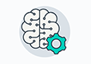

#  Udacity 机器学习入门课程完成项目

-------------------------

1. 【统计基础】项目：[检验心理学现象](p1-instruction-zh)
2. 【编程基础】项目：[创建电影网站](p2_fresh_tomatoes)
3. 【线性代数基础】项目：[线性回归](p3_linear_regression_project)
4. 【数据分析基础】项目：[泰坦尼克号乘客样本数据分析报告](p4_investigate_titanic_data)
5. 【模型的评估与验证】项目：[预测波士顿房价](p5_boston_housing)
